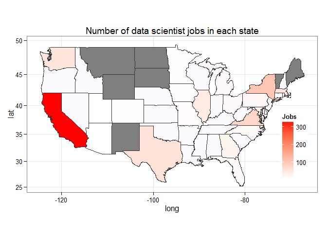
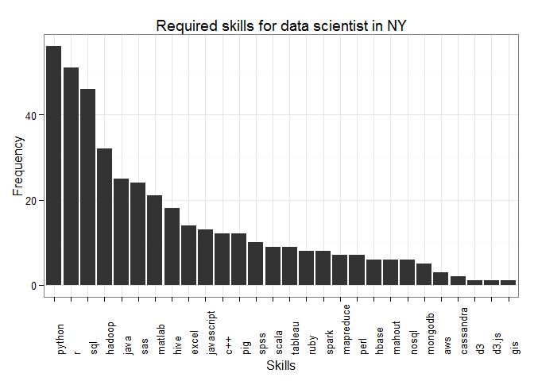

-   [Job Market and Skill Requirements for Data Scientists](#job-market-and-skill-requirements-for-data-scientists)
    -   [Data source](#data-source)
        -   [Web scraping with Python](#web-scraping-with-python)
        -   [Plots with R](#plots-with-r)

Job Market and Skill Requirements for Data Scientists
=====================================================

Job hunters usually want to know what kind of skills they need for certain types of jobs and where the job market is big. Thus it is useful to create a system to display the spatial distribution of given jobs. What is more, the skills required for a given job may differ across locations. It will also be helpful to display the desired skills over space.

Data source
-----------

This proposed project mainly depends on the data scraped from indeed.com. For a given type of job, the job title, job location, and job link will be scraped from indeed.com. With the job links, we can scraped the job description in each job page and extract all of the visible text from it. The visible text will be processed to removed some punctuation and split into words. These words will be used to generate word clouds and extract the required skills.

In this example, I used Python to scrape the web data from indeed.com and use R to generate the plots

### Web scraping with Python

This part explain the process of web scraping with Python.

1.Here is the Python modules required for this analysis

``` r
import bs4 
import urllib
import re
import time
import pandas as pd
import numpy as np
from stop_words import get_stop_words
import collections
```

1.  Using the `urllib` and `bs4 (BeautifulSoup)` modules, we can extract the total number of open positions for "data scientist", and calculate the number of pages we need to scrape from indeed.com.

``` r
cd 'your\working\directory'
url = 'http://www.indeed.com/jobs?q="data+scientist"&start='
source = urllib.request.urlopen(url).read().decode()
bs_tree = bs4.BeautifulSoup(source)

# check the number of jobs and pages
n_jobs_string = bs_tree.find(id = 'searchCount').contents[0].split()[-1]
n_jobs = int(re.sub(',', '', n_jobs_string))
n_pages = int(np.ceil(n_jobs/10.0))
```

1.  Then, we will go through all pages and extract the job title, company, location, ID, and link for each job. All of these information is put into a data frame, and the duplicated records are removed.

``` r
# scrape all jobs title, company, location, id, and link
base_url = 'http://www.indeed.com'
job_title = []
job_cmp = []
job_loc = []
job_id = []
job_link = []

for i in range(n_pages): #do range(num_pages) if you want them all
    print(i)
    url = 'http://www.indeed.com/jobs?q="data+scientist"&start=' + str(i*10)
    html_page = urllib.request.urlopen(url).read().decode()
    bs_tree = bs4.BeautifulSoup(html_page)
    
    divs = bs_tree.findAll('div')
    
    job_div = [jp for jp in divs if not jp.get('class') is None 
                    and 'row' in jp.get('class')]
    
    for j in job_div: 
        id = j.get('data-jk', None)
        title = j.find_all('a', {'data-tn-element': 'jobTitle'})
        company = j.find_all('span', {'class': 'company'})
        location = j.find_all('span', {'class': 'location'})
        
        job_title.append(str.strip(title[0].text) if title else None)
        job_cmp.append(str.strip(company[0].text) if company else None)
        job_loc.append(str.strip(location[0].text) if location else None)
        job_id.append(id)
        job_link.append(base_url + '/rc/clk?jk=' + id)

    # print(len(job_link), len(job_title), len(job_cmp), len(job_loc))

    time.sleep(1 + np.random.rand(1))   

job_df = pd.DataFrame({'job_title': job_title,
                       'job_cmp' : job_cmp,
                       'job_loc' : job_loc, 
                       'job_id' : job_id,
                       'job_link': job_link})
                       
job_df = job_df.drop_duplicates()
```

1.  With the job links, we can go to each job page and extract all visible texts from it. For each position (job page), the visible texts can be processed with the following steps:

-   Remove useless information (e.g., stop words, and punctuation) to generate clean text.
-   Split the cleaned texts into words
-   Match the words with commonly used skills (prepared beforehand) to generate the required skills for the given position

After scraping all positions, the required skills and words are added to the original data frame as to new columns. Then, the data frame is saved as csv file for future usage.

``` r
# extract contents from job_link
# skill sets: reference to https://jessesw.com/Data-Science-Skills/ 
skills = ['Scala', 'Ruby', 'C++', 'Perl', 'R', 'Java', 'Matlab', 'JavaScript', 
          'Python', 'SPSS', 'D3.js', 'Tableau', 'Excel', 'SAS', 'D3', 'Mahout',
          'Hadoop', 'Pig', 'Spark', 'ZooKeeper', 'MapReduce', 'Shark', 'Hive',
          'Oozie', 'Flume', 'HBase', 'Cassandra', 'NoSQL', 'SQL', 'MongoDB', 'GIS',
          'AWS', 'Haskell', 'PHP', 'Perl', 'Stata']

skills_lower = [s.lower() for s in skills]

job_skills = []
job_words = []
stop_words = get_stop_words('english')

def visible(element):
    if element.parent.name in ['style', 'script', '[document]', 'head', 'title']:
        return False
    elif re.match('<!--.*-->', str(element)):
        return False
    elif element == u'\xa0':
        return False
    return True
    
for i in range(len(job_df)):
    print(i)
    try:
        job_page = urllib.request.urlopen(job_df.iloc[i, 2]).read().decode()
    except:
        job_skills.append(None)
        job_words.append(None)
        continue
    
    soup = bs4.BeautifulSoup(job_page)
    texts = soup.findAll(text=True)
    visible_texts = list(filter(visible, texts))

    string = re.sub('[^a-z.+3]', ' ', ' '.join(visible_texts).lower())
    string = re.sub('\.\s+', ' ', string)  # remove the . at the end of sentences
    words = str.split(string)
    words = set(words) - set(stop_words)  # remove stop words
    
    required_skills = list(words.intersection(skills_lower))
    job_skills.append(required_skills)
    job_words.append(list(words))
    
    time.sleep(1 + np.random.rand(1))

job_df['skills'] = job_skills
job_df['words'] = job_words
job_df.to_csv('indeed_DS_jobs_skills8.csv')  # save the output for future use
```

### Plots with R

This part explains the processes of ploting the spatial job distribution, word cloud, and required skills in R. It requires a few steps to extract some useful information and reformatting, so that they can be used as input data for plots: 1. extract the state abbreviation from the job location column 2. convert the state abbreviation to full name 3. match the number of jobs in each state to the state map by full state name

``` r
library(dplyr)
library(ggplot2)
library(wordcloud)
# district of columbia (DC) is missing from the state.name and state.abb. Add them
state.name = c(state.name, 'district of columbia')
state.abb = c(state.abb, 'DC')

df <- read.csv('indeed_DS_jobs_skills.csv')
df$State <- sub('.*, ', '', df$job_loc) %>% sub(' .*', '', .)
df$State_abb <- ifelse(is.na(match(df$State, state.name)), df$State, 
  state.abb[match(df$State, state.name)])  # convert some full name to abbrevation
df$State_name <- state.name[match(df$State_abb, state.abb)]

state_jobs <- count(df, State_name)

states_map <- map_data('state')
states_map$state_jobs <- state_jobs$n[match(states_map$region, 
  tolower(state_jobs$State_name))]
```

-   Here is the code used to make the spatial job distribution map

``` r
ggplot(states_map, aes(x = long, y = lat, fill = state_jobs, group = group)) + 
  geom_polygon(color = 'grey20') + 
  coord_map(projection = 'mercator') + 
  scale_fill_gradient2(low = 'blue', high = 'red',
    midpoint = median(state_jobs$n), name = 'Jobs') + 
  theme_bw() + 
  labs(title = 'Number of data scientist jobs in each state') + 
  theme(legend.position = c(.92, .3))
```



``` r
ggsave('states_job.png')
```

-   Here is the code used to make the word cloud, taking NY state as an example

``` r
words_NY <- df$words[df$State_abb == 'NY']
wordcloud(words_NY, colors=brewer.pal(8, "Dark2"))
```


``` r
invisible(dev.copy(png, 'wordcloud.png'))
invisible(dev.off())
```

-   Here is the code used to make the required skills plot for NY.

``` r
skills_NY <- df$skills[df$State_abb == 'NY'] %>%
    paste(collapse = ' ') %>%
    gsub('[^a-z.+3]', ' ', .) %>%
    gsub('^\\s+', '', .) %>%
    strsplit(split = '\\s+') %>%
    unlist()

# arrange the level of skills, so that they can be plotted from big to small    
skills_factor <- factor(skills_NY, levels = names(sort(-table(skills_NY))))
qplot(skills_factor) + 
    theme_bw() + 
    labs(title = 'Required skills for data scientist in NY', x = 'Skills', 
    y = 'Frequency') + 
    theme(axis.text.x = element_text(angle = 90, hjust = 0))
```



``` r
ggsave('skills.png')
```
